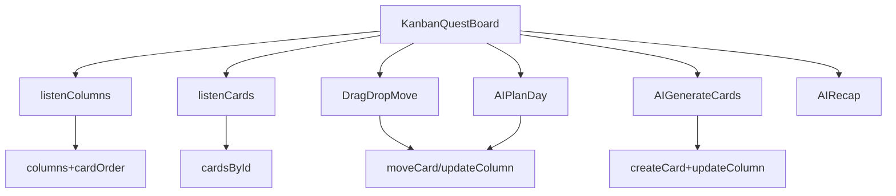

# Kanban Quests UX Plan

## Why the current structure feels confusing (what I saw)

- The Quests page (`components/DailyQuestBoard.tsx`) is built around `WeekData` → `DayData` → `blocks: ScheduleBlock[]` (list UI with an optional weekly grid).
- You already have a Kanban-capable Firestore schema implemented in `services/firestore.ts` (`boards/columns/cards` with `cardOrder`) but it’s currently unused by the UI.

Key references:

- Current quests data model: `WeekData` / `ScheduleBlock` in `types.ts`.
- Existing Kanban model + APIs: `services/firestore.ts` (types `Board`, `Column`, `Card`; functions `createBoard`, `createColumn`, `createCard`, `moveCard`, listeners).

## Target UX (status Kanban)

- A single Kanban board on `/quests` with 4 columns:
  - `backlog`
  - `today`
  - `in_progress`
  - `done`
- Each quest is a card (emoji + title + optional note, energy, type).
- Drag-and-drop to move/reorder cards.
- One-click “Done” toggle (also moves to/from `done`).

## Data model / persistence approach

- Use the already-implemented Firestore Kanban collections under `users/{uid}/boards/{boardId}`.
- Introduce a single default board for quests, e.g. `boardId = "quests"`.
- Store ordering in each column doc via `cardOrder` (already supported).
- Keep card fields compatible with what you already have (title/emoji/note/blockType/energyLevel/done), and optionally add `completedAt` for better reflection targeting.

## One-time migration (so users don’t lose current quests)

- On first load of the new Kanban quests board, if the `quests` board does not exist:
  - Read the current `weeks/{weekKey}` doc.
  - Convert all `ScheduleBlock`s into Kanban cards.
  - Place them based on status:
    - `done === true` → `done`
    - blocks belonging to *today* → `today`
    - everything else → `backlog`
  - Preserve original day/time in `note` (or a small metadata field) so context isn’t lost.

## AI features (the 3 you selected)

### 1) Generate cards

- Add “AI Generate” button that creates N cards into `backlog` (default) or `today`.
- Reuse the existing Gemini integration pattern from `DailyQuestBoard.tsx`, but update the JSON schema to return Kanban-card fields (`title`, `emoji`, `note`, `blockType`, `energyLevel`, optional `estimateMinutes`).

### 2) Auto-plan the day

- Add “Plan my day” button:
  - Inputs to AI: backlog cards (and optionally existing today/in-progress), plus optional constraints (max cards, time budget).
  - AI returns an ordered list of card IDs/titles to move into `today` and recommended order.
  - Apply changes by updating column `cardOrder` (and moving cards between columns).

### 3) Reflection summary

- Add “Daily recap” button:
  - Summarize what was completed (primarily from `done` cards and/or completion timestamps/logs).
  - Save the recap somewhere lightweight (either as a new per-day doc under `users/{uid}/reflections/{date}` or as a `reflectionNote` on the relevant cards).

## Implementation notes (minimal, pragmatic)

- Add a new component, e.g. `components/KanbanQuestBoard.tsx`, and swap `/quests` route in `App.tsx` to use it.
- Use a drag-and-drop library (likely `@dnd-kit/core` + `@dnd-kit/sortable`) since none is currently installed.
- Extend `services/firestore.ts` with a small “ensure default quests board exists” helper and higher-level helpers for:
  - creating default columns
  - inserting a card at top/bottom of a column
  - moving/reordering within a column

## Mermaid: high-level data flow

